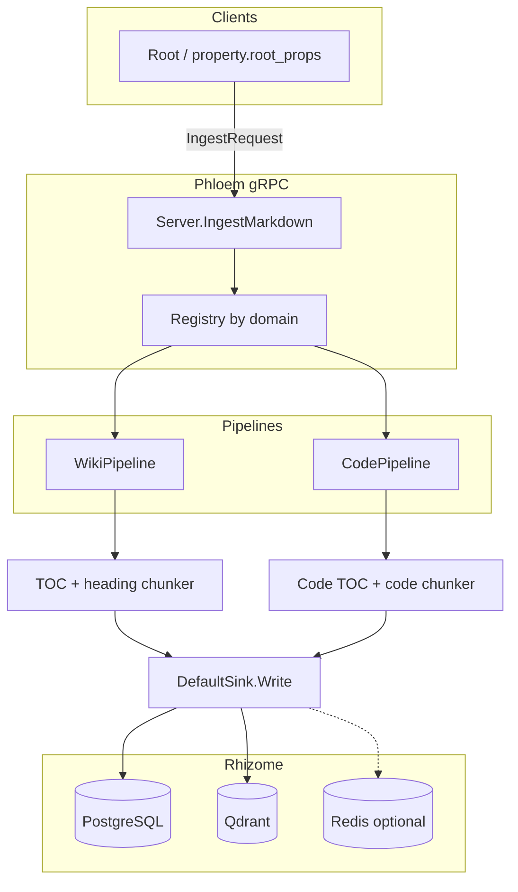
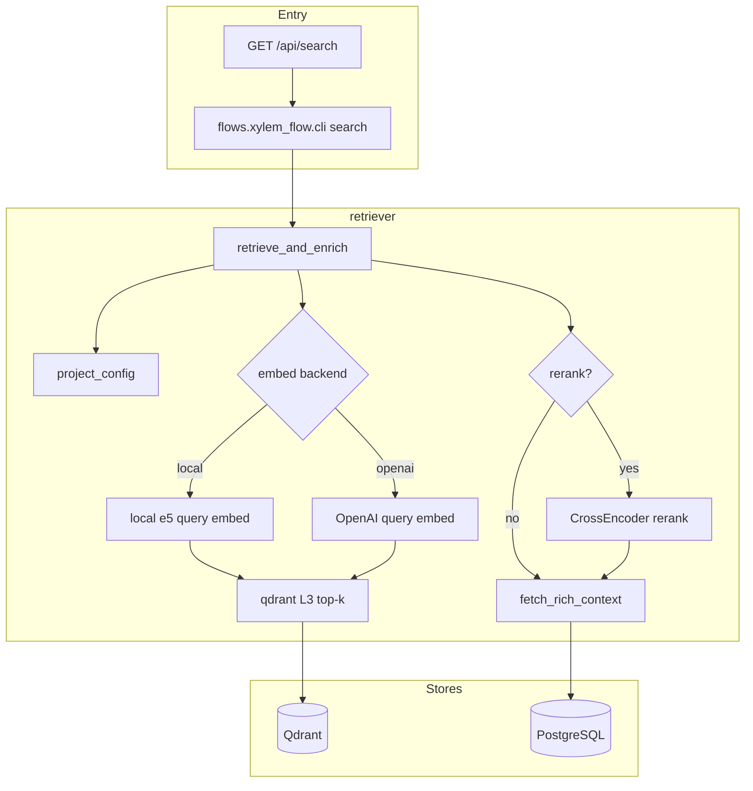
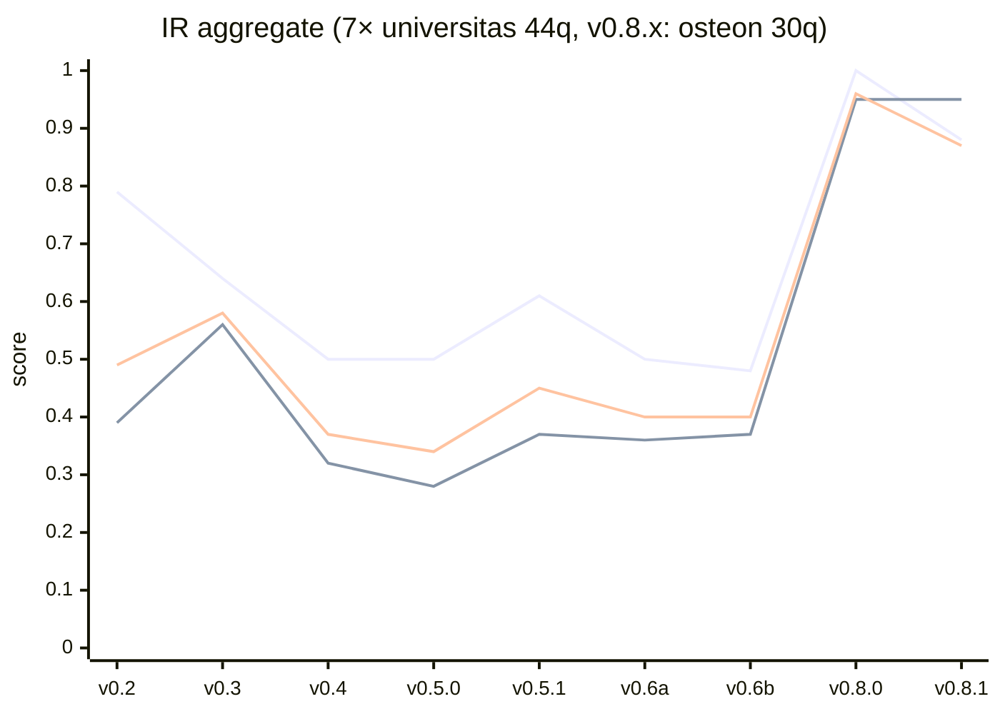

# 🌿 Gopedia: Enterprise Knowledge Rhizome

> **"데이터의 토양에 지식의 뿌리를 깊게 내리고, 유기적으로 연결된 지혜의 열매를 맺는다."**

Gopedia는 **인제스트(Ingestion)**와 **RAG(Retrieval-Augmented Generation)**에 특화된 고효율 **엔터프라이즈 지식 그래프** 플랫폼입니다. 파편화된 정보를 하나의 “지식 신경망”으로 엮고, 관계 추론과 맥락 이해를 중심에 둔 **엔터프라이즈 온톨로지**의 기반이 됩니다.

**English README:** [`README.md`](./README.md)

---

## ✨ 핵심 가치

* 🔌 **Pluggable (Root)**: 워크스페이스·프로젝트 단위로 외부 데이터 소스를 유연하게 연결합니다.
* 📈 **Scalable (Stem)**: gRPC·Protobuf 기반의 고처리량 파이프라인입니다.
* 🔗 **Relational (Rhizome)**: 단순 저장을 넘어, 벡터·그래프 DB로 지식의 유기적 네트워크를 구성합니다.
* 🍎 **Actionable (Fruit)**: 검색된 데이터를 의사결정에 바로 쓸 수 있는 보고·인사이트로 전환합니다.

---

## 🏗️ 아키텍처: 뿌리줄기(Rhizome) 은유

**뿌리줄기(Rhizome)** — 수평으로 퍼지며 위계 없이 확장 가능한 뿌리 — 에서 영감을 받아, 모듈화되면서도 유기적으로 연결된 구조를 지향합니다.

### 1. Root — *연결 가능한 소스 & 워크스페이스*

데이터가 들어오는 진입점입니다. 프로젝트 워크스페이스(디렉터리·저장소)를 등록하고, DB·API·스트림·파일 시스템 등 외부 소스와의 연결 규약을 정의합니다.

### 2. Stem — *확장 가능한 파이프라인*

데이터를 나르는 두 갈래 흐름입니다.

* **Phloem (인제스트)**: **Root → Stem → Rhizome**. 원시 데이터를 담고, 프로젝트 → 문서 → L1/L2/L3로 구조화하며, 문장 분리·엔티티 마스킹 등 NLP를 수행한 뒤 **스마트 싱크**로 Rhizome에 기록합니다.
* **Xylem (RAG)**: **Rhizome → Leaf/Fruit**. 벡터 검색으로 L3 청크를 찾고, 선택적으로 **크로스 인코더 리랭크**를 거친 뒤, 상위 구조(L2 섹션·표·코드 블록 등)를 복원해 풍부한 프롬프트 컨텍스트를 만듭니다.

> **버전 안내(파이프라인)**: 아래 다이어그램은 **현재 메인라인 코드**와 **[Rev4 설계](./doc/design/Rev4/)**(청킹, 원자 L3, 검색 정책)를 기준으로 합니다. 재현용 빌드 식별자는 `git describe --tags`를 사용하세요(`v0.1.0-…-g<hash>` 형태). **정본 다이어그램·갭 목록**은 **[Phloem(인제스트)](./doc/design/phloem/README.md)**, **[Xylem(RAG)](./doc/design/xylem/README.md)**에 있으며, 단계별 상세는 [`doc/design/phloem/pipeline.md`](./doc/design/phloem/pipeline.md), [`doc/design/xylem/pipeline.md`](./doc/design/xylem/pipeline.md)를 보세요.

**Phloem (인제스트)** — gRPC `IngestMarkdown` → 도메인 파이프라인(`wiki` / `code`) → `DefaultSink` → PostgreSQL, Qdrant, 선택 Redis(Tuber).

**Xylem (RAG)** — `flows.xylem_flow`(CLI 또는 `GET /api/search` 서브프로세스): 쿼리 임베딩 → Qdrant L3 검색 → 선택 **리랭크** → `fetch_rich_context`(PostgreSQL).

### 3. Rhizome — *관계형·폴리글랏 저장*

**지식의 토양** — 식별자와 관계 추론을 **폴리글랏 퍼시스턴스**로 다룹니다.

* **PostgreSQL**: 정본 저장, 계층 구조, idempotency 해시, Tuber 엔티티(`keyword_so`).
* **Qdrant**: 의미 벡터 검색.
* **TypeDB**: 관계 추론·그래프 순회.

### 4. Leaf & Fruit — *뷰 & 실행 가능한 산출*

* **Leaf(인덱싱 뷰)**: 마크다운·코드·티켓 등 도메인별 뷰.
* **Fruit(리포트)**: 여러 Root·Leaf를 묶어 사람이 읽을 수 있는 최종 답·템플릿.

---

## 📊 데이터 계층

단순 “청크”가 아니라, 고품질 검색과 idempotency를 위해 의미 있는 계층으로 나눕니다.

| 단계 | 엔터티 | 설명 |
| --- | --- | --- |
| **Project** | `projects` | 워크스페이스 루트. 전역적으로 안정적인 `machine_id`를 둡니다. |
| **Doc** | `documents` | 프로젝트 안의 논리 문서 앵커. |
| **L1** | `knowledge_l1` | 문서 스냅샷·리비전. 목차·요약. |
| **L2** | `knowledge_l2` | 섹션·표·AST·흐름 등 **뼈대**. |
| **L3** | `knowledge_l3` | 검색에 임베딩되는 **원자** 콘텐츠(문장 등). |
| **Keyword** | `keyword_so` | Tuber 엔티티(태그·키워드), 안정 `machine_id`에 매핑. |

### RAG 품질: 리포트 버전별 IR 지표(스냅샷)

Gardener **집계** 지표(**Recall@5**, **MRR@10**, **nDCG@10**). 앞 7개 점은 **`universitas_factual_v1`(44q)** 정의, **`v0.8.0`**·**`v0.8.1`** 은 **osteon 30q** 데이터셋 — **데이터셋이 다르므로** `v0.6b`→`v0.8.0` 구간을 제품 개선 추세로 단정하지 마세요. **전체 표, 리포트별 링크, P@3, osteon 점수가 높게 보이는 이유**는 [RAG 리포트 README의 IR 스냅샷 절](./doc/rag-test-reports/README.md#ir-metrics-snapshot)을 참고하세요.

→ **상세(표, 리포트 링크, 주석):** [`doc/rag-test-reports/README.md#ir-metrics-snapshot`](./doc/rag-test-reports/README.md#ir-metrics-snapshot)

---

## 🚀 로드맵: 설계 단계

현재 **Rev2(성장·결실)** 단계로 전환 중입니다.

1. **Verify(발아) `완료`**: 마크다운·코드 소스에서 Rhizome까지 흐름 검증.
2. **Expand(성장) `진행 중`**: 프로젝트 단위 인제스트, Tuber `machine_id` 매핑, AST 파싱, NER 등 분산 처리 활성화.
3. **Connect(결실)**: GeneSo 생태계와 통합, 복잡한 RAG Fruit(Skill Engine), ReBAC(SpiceDB) 등.

---

## HTTP API + CLI (Fuego)

- **API 서버**: `go run ./cmd/api` — `GOPEDIA_HTTP_ADDR`(기본 `127.0.0.1:8787`). 라우트: `GET /api/health`, `GET /api/search?q=...`, `POST /api/ingest` 및 JSON `{"path":"/abs/path"}`.
- **CLI**: `go run ./cmd/gopedia …` — `GOPEDIA_API_URL`(기본 `http://127.0.0.1:8787`). 예: `gopedia server`, `gopedia search "Introduction"`, `gopedia ingest /path/to/project`.
- **Python**: 저장소 루트에서 `python3 -m property.root_props.run`, `python3 -m flows.xylem_flow.cli`를 호출합니다. CWD에서 `go.mod`를 찾지 못하면 `GOPEDIA_REPO_ROOT`를 설정하세요.

---

## 📚 문서

| 주제 | 링크 |
| --- | --- |
| **Phloem(인제스트) — 다이어그램·갭** | [`doc/design/phloem/README.md`](./doc/design/phloem/README.md) |
| **Phloem — 파이프라인 단계(코드 기준)** | [`doc/design/phloem/pipeline.md`](./doc/design/phloem/pipeline.md) |
| **Xylem(RAG+리랭크) — 다이어그램·갭** | [`doc/design/xylem/README.md`](./doc/design/xylem/README.md) |
| **Xylem — 파이프라인 단계(코드 기준)** | [`doc/design/xylem/pipeline.md`](./doc/design/xylem/pipeline.md) |
| **청킹 / L3 / 검색 전략 (Rev4)** | [`doc/design/Rev4/`](./doc/design/Rev4/) |
| **Rhizome 개요 (Rev2)** | [`doc/design/Rev2/01-overview.md`](./doc/design/Rev2/01-overview.md) |
| **실행 + API** | [`doc/guide/run.md`](./doc/guide/run.md) |
| **RAG 테스트 리포트 + IR 버전 차트(전체 표·노트)** | [`doc/rag-test-reports/README.md#ir-metrics-snapshot`](./doc/rag-test-reports/README.md#ir-metrics-snapshot) |

---

## 설치·첫 시나리오

**사전 요구** — 설치에 필요한 최소 환경(Kubernetes 버전, CPU/메모리, 도구):

- Kubernetes `v1.28+` *또는* Docker Compose 기반 개발 스택
- 최소 `4 vCPU / 8GB RAM` (3노드급 구성 권장 `8 vCPU / 16GB RAM`)
- 필수: `git`, `docker`, `docker compose` · 선택: `go`, `python`, `node`

**설치(약 5분)** — **Docker Compose** 기준 복붙 가능한 절차는 아래 가이드에 있습니다.

- 상세: [`doc/guide/install.md`](./doc/guide/install.md)
- 요약: [`doc/guide/quick-install-guide.md`](./doc/guide/quick-install-guide.md)

**동작 확인**

- `curl http://127.0.0.1:18787/api/health` 가 JSON이면 성공.
- `GET /api/search?q=test`에 결과가 오면 정상.

**정리(스택 제거)**

- `docker compose -f docker-compose.dev.yml --env-file .env down -v`

**첫 시나리오(약 10분)** — 설치 직후: Obsidian 볼트에 샘플 노트 작성 → 인제스트 → 검색 API로 확인. 이후 [gardener_gopedia](https://github.com/tojiuni/gardener_gopedia/blob/main/README.md)로 품질 측정, [gopedia_mcp](https://github.com/tojiuni/gopedia_mcp/blob/main/README.md)로 에이전트 질의 재현.

**프로덕션 문의:** [contact@cloudbro.ai](mailto:contact@cloudbro.ai) (Cloudbro 채널)

---

## 📝 라이선스

이 프로젝트는 **Apache 2.0** 라이선스를 따릅니다.
