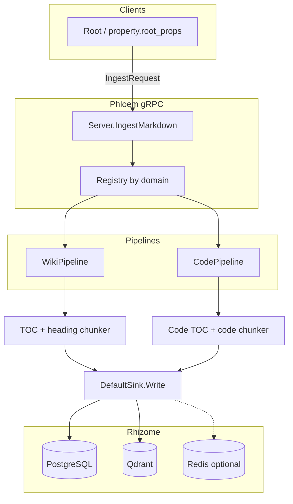
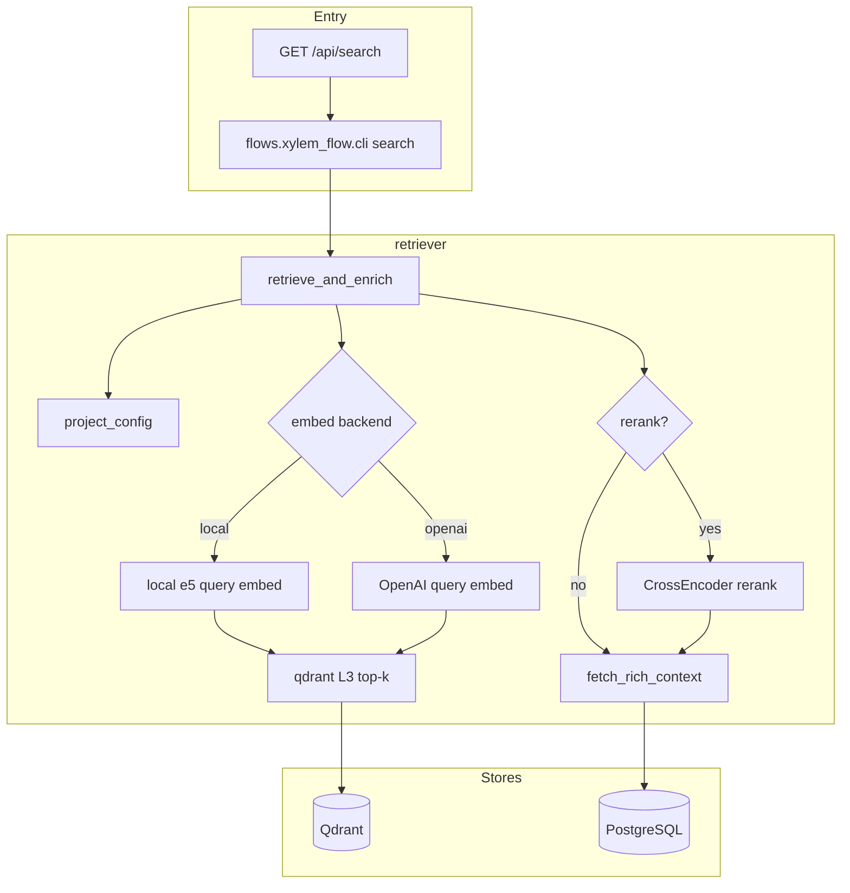
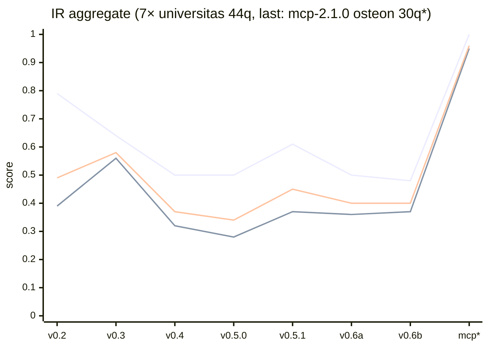

# 🌿 Gopedia: Enterprise Knowledge Rhizome

> **"Deepening the roots of knowledge in the soil of data to bear the fruits of organically connected wisdom."**

Gopedia is a high-efficiency Enterprise Knowledge Graph Platform specializing in **Ingestion** and **RAG (Retrieval-Augmented Generation)**. It integrates fragmented information into a cohesive "knowledge neural network," providing a foundation for **Enterprise Ontology** where relationship reasoning and contextual understanding are at the core.

---

## ✨ Key Values

* 🔌 **Pluggable (Root)**: Seamlessly connect any external data source at a workspace/project scale.
* 📈 **Scalable (Stem)**: High-throughput pipelines built on gRPC/Protobuf.
* 🔗 **Relational (Rhizome)**: Beyond simple storage—building an organic network of knowledge using vector and graph databases.
* 🍎 **Actionable (Fruit)**: Transforming retrieved data into decision-ready reports and insights.

---

## 🏗️ Architecture: The Rhizome Metaphor

Inspired by the **Rhizome**—a horizontal, non-hierarchical, and infinitely expandable root system—Gopedia’s architecture ensures that every component is modular yet organically linked.

### 1. Root — *Pluggable Sources & Workspaces*
The "entry point" where nutrients (data) are absorbed. It registers entire Project Workspaces (directories or repos) and defines connection standards for external sources like Databases, APIs, Streams, and File Systems.

### 2. Stem — *Scalable Pipelines*
The transport system for data, divided into two vital flows:
* **Phloem (Ingestion)**: **Root → Stem → Rhizome**. Encapsulates raw data, structures it hierarchically (Project → Document → L1/L2/L3), handles NLP tasks (Sentence Splitting, Entity masking), and records them into the Rhizome via **Smart Sinks**.
* **Xylem (RAG)**: **Rhizome → Leaf/Fruit**. Retrieves L3 chunks via vector search, optional **cross-encoder rerank**, and reconstructs parent structural context (L2 sections, tables, code blocks) for rich prompt injection.

> **Version note (pipelines)**: The diagrams below match the **current mainline code** and **[Rev4 design notes](./doc/design/Rev4/)** (chunking, atomic L3, retrieval policy). For a reproducible build identifier, run `git describe --tags` (pre-release id looks like `v0.1.0-…-g<hash>`). **Authoritative, maintained diagrams and gap lists** live in **[Phloem (ingest)](./doc/design/phloem/README.md)** and **[Xylem (RAG)](./doc/design/xylem/README.md)**; deeper stage-by-stage text is in [`doc/design/phloem/pipeline.md`](./doc/design/phloem/pipeline.md) and [`doc/design/xylem/pipeline.md`](./doc/design/xylem/pipeline.md).

**Phloem (Ingestion)** — gRPC `IngestMarkdown` → domain pipeline (`wiki` / `code`) → `DefaultSink` → PostgreSQL, Qdrant, optional Redis (Tuber).

**Xylem (RAG)** — `flows.xylem_flow` (CLI or `GET /api/search` via subprocess): query embedding → Qdrant L3 search → optional **rerank** → `fetch_rich_context` (PostgreSQL).

### 3. Rhizome — *Relational & Polyglot Storage*
The "Knowledge Soil." This layer handles identity and relationship reasoning using **Polyglot Persistence**:
* **PostgreSQL**: For canonical storage, strict structural hierarchy, idempotency hashing, and Tuber entities (`keyword_so`).
* **Qdrant**: For semantic vector search.
* **TypeDB**: For relationship reasoning and deep graph traversal.

### 4. Leaf & Fruit — *Views & Actionable Outputs*
* **Leaf (Indexing View)**: Domain-specific views such as Markdown, Code, or Ticket indexes.
* **Fruit (Reports)**: Final templates or generated answers that combine data from multiple Roots and Leaves into a human-readable format.

---

## 📊 Data Hierarchy

Gopedia does not just "chunk" data; it categorizes it into a meaningful hierarchy to ensure high-fidelity retrieval and idempotency.

| Level | Entity | Description |
| --- | --- | --- |
| **Project** | `projects` | The root workspace container. Has a globally stable `machine_id`. |
| **Doc** | `documents` | The logical file anchor within a Project. |
| **L1** | `knowledge_l1` | Document snapshot/revision. Holds the Table of Contents and summary. |
| **L2** | `knowledge_l2` | The "Skeleton" of data (Sections, Tables, AST structures, Logic flows). |
| **L3** | `knowledge_l3` | Atomic content (e.g., sentences) that are vectorized for search. |
| **Keyword** | `keyword_so` | Tuber entity (Tags/Keywords) mapped to a stable `machine_id`. |

### RAG quality: IR metrics by report version (snapshot)

Gardener aggregate metrics (**Recall@5**, **MRR@10**, **nDCG@10**) across saved evaluation reports. The first seven points use the **`universitas_factual_v1` (44q)** definition; the last point **`mcp*`** is **[`mcp-2.1.0` osteon 30q](./doc/rag-test-reports/mcp-2.1.0_2026-04-08_gardener-gopedia-stack.md)** — a different dataset, so do not read a rising line from `v0.6b` to `mcp*` as a product improvement. **Full tables, per-report links, P@3, and why osteon scores can look high** are documented in [`doc/rag-test-reports/README.md`](./doc/rag-test-reports/README.md) (see the [IR metrics snapshot](./doc/rag-test-reports/README.md#ir-metrics-snapshot) section).

→ **Details (full table, report links, mcp notes):** [`doc/rag-test-reports/README.md#ir-metrics-snapshot`](./doc/rag-test-reports/README.md#ir-metrics-snapshot)

---

## 🚀 Roadmap: Design Phases

We are currently transitioning into the **Rev2 (Growth & Fruition)** phase.

1. **Verify (Germination) `COMPLETED`**: Validating the flow from Markdown and Code sources into the Rhizome.
2. **Expand (Growth) `IN PROGRESS`**: Activating distributed processing via Project-level Ingestion, Tuber `machine_id` mappings, AST parsing, and NLP entity extraction (NER).
3. **Connect (Fruition)**: Full integration with the GeneSo ecosystem, featuring complex RAG Fruit (Skill Engine) and ReBAC (Relationship-Based Access Control via SpiceDB).

---

## HTTP API + CLI (Fuego)

- **API server**: `go run ./cmd/api` — listens on `GOPEDIA_HTTP_ADDR` (default `127.0.0.1:8787`). Routes: `GET /api/health`, `GET /api/search?q=...`, `POST /api/ingest` with JSON `{"path":"/abs/path"}`.
- **CLI client**: `go run ./cmd/gopedia …` — talks to `GOPEDIA_API_URL` (default `http://127.0.0.1:8787`). Examples: `gopedia server`, `gopedia search "Introduction"`, `gopedia ingest /path/to/project`.
- **Python**: the API runs `python3 -m property.root_props.run` and `python3 -m flows.xylem_flow.cli` from the repo root. Set `GOPEDIA_REPO_ROOT` if `go.mod` is not discoverable from the process cwd.

---

## 📚 Documentation

| Topic | Link |
| --- | --- |
| **Phloem (ingestion) — diagram + gaps** | [`doc/design/phloem/README.md`](./doc/design/phloem/README.md) |
| **Phloem — pipeline stages (code-aligned)** | [`doc/design/phloem/pipeline.md`](./doc/design/phloem/pipeline.md) |
| **Xylem (RAG + rerank) — diagram + gaps** | [`doc/design/xylem/README.md`](./doc/design/xylem/README.md) |
| **Xylem — pipeline stages (code-aligned)** | [`doc/design/xylem/pipeline.md`](./doc/design/xylem/pipeline.md) |
| **Chunking / L3 / retrieval strategy (Rev4)** | [`doc/design/Rev4/`](./doc/design/Rev4/) |
| **Rhizome overview (Rev2)** | [`doc/design/Rev2/01-overview.md`](./doc/design/Rev2/01-overview.md) |
| **Run + API** | [`doc/guide/run.md`](./doc/guide/run.md) |
| **RAG test reports + IR version chart (full table & notes)** | [`doc/rag-test-reports/README.md#ir-metrics-snapshot`](./doc/rag-test-reports/README.md#ir-metrics-snapshot) |

## Installation & first scenario

**Prerequisites** — minimum environment for install (Kubernetes version, CPU/RAM, tools):

- Kubernetes `v1.28+` *or* a Docker Compose–based dev stack
- At least `4 vCPU / 8 GB RAM` (for a three-node–style setup, `8 vCPU / 16 GB RAM` is recommended)
- Required tools: `git`, `docker`, `docker compose`; optional: `go`, `python`, `node`

**Install (under ~5 minutes)**

- Copy-pasteable commands are documented for **Docker Compose** in the guides below.
- For a quick local stack, follow the Compose commands in:
  - Details: [`doc/guide/install.md`](./doc/guide/install.md)
  - Short version: [`doc/guide/quick-install-guide.md`](./doc/guide/quick-install-guide.md)

**Verify it works**

- Success if `curl http://127.0.0.1:18787/api/health` returns JSON.
- Success if `GET /api/search?q=test` returns results.

**Tear down**

- `docker compose -f docker-compose.dev.yml --env-file .env down -v`

**First scenario (under ~10 minutes)**

- One demo path you can run right after install: create sample notes in an Obsidian vault, ingest them, then check the search API.
- Next, run quality evaluation with [gardener_gopedia](https://github.com/tojiuni/gardener_gopedia/blob/main/README.md) and reproduce agent-style queries with [gopedia_mcp](https://github.com/tojiuni/gopedia_mcp/blob/main/README.md).

**Production inquiries:** [contact@cloudbro.ai](mailto:contact@cloudbro.ai) (Cloudbro channel).

**Korean README:** [`README(kor).md`](./README(kor).md)

---

## 📝 License

This project is licensed under the **Apache 2.0 License**.
