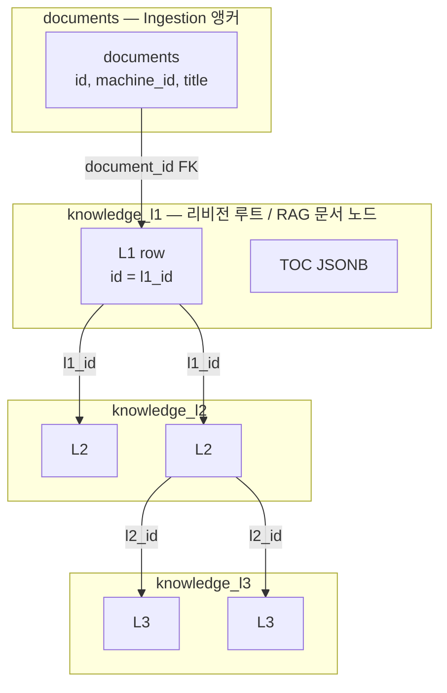

# End-to-End Data Flow

[05-storage-and-payloads.md](05-storage-and-payloads.md)의 식별자 규칙을 전제로 한 흐름이다. **논리 문서 앵커는 `documents`** 이며, **`knowledge_l1`은 리비전 루트**다.

## 1. Ingestion (Go — Phloem)

1. **`documents` 행 확보**: `machine_id` 기준 UPSERT 등으로 앵커 생성·갱신. `documents.id` = 캐논 `doc_id`.
2. **`knowledge_l1` 삽입**: `document_id = documents.id` 로 루트 스냅샷(리비전) 생성. `version_id`·`created_at` 등으로 스냅샷 구분.
3. Markdown 등: 파싱 → **L2(헤더 기반) 청킹** → L3.
4. **Idempotency**: `l2_child_hash` / `l3_child_hash` 및 행 단위 해시. [02-idempotency-and-tuber.md](02-idempotency-and-tuber.md).
5. **Tuber**: `pipeline_version`, 키워드 → Redis `kw:*` → **`keyword_so.machine_id`** (문서 `machine_id` 와 별개 엔티티).

---

## 2. L2 Hierarchy Flow (헤더 트리)

Markdown 헤더로 **부모–자식** L2 관계. **`depth` 컬럼 없음** — `parent_id` + `sort_order`.

- 동일 **`l1_id`** 아래에서 L2 트리가 형성된다(특정 리비전의 L1).

---

## 3. L3 Sequence Flow (그룹·문맥)

문장 단위 L3는 **`sort_order`** 와 **`parent_id`** 로 순서·그룹을 표현. 상세 규칙은 인제스트 구현과 [05](05-storage-and-payloads.md) 참고.

---

## 4. Processing

**A. Summary Pipeline** — L2 요약 후 L1 루트 요약은 `knowledge_l1` 등에 저장.

**B. L3 + NLP (Python Worker)** — L2 텍스트 → 문장 분리·NER → L3 저장·Qdrant·TypeDB.

---

## 5. Storage (요약)

- **PostgreSQL**: `documents`(앵커), `knowledge_l1`(리비전 루트·`l1_id`), L2/L3.
- **Qdrant**: L1/L3 벡터 + Payload **`l1_id`**, `l2_id`, `l3_id`, `section_id`, … (`doc_id` / `machine_id` / `toc_path` / `level` 없음)
- **TypeDB**: **문서 노드 = `l1_id`** 로 연결해 모든 적재 L1을 RQG 대상으로 할 수 있음.
- **Redis**: Tuber `kw:*` → **keyword** `machine_id`.

---

## 6. TOC (JSONB) Flow

인제스트 시 **`knowledge_l1.toc`** 에 경량 목차를 넣어 에이전트가 지도로 사용.

---

## 7. 아키텍처 다이어그램 (Mermaid)

- **TypeDB / RAG**: 질의·그래프의 “문서” 정점은 **`l1_id`** (`knowledge_l1.id`).
- **`documents`**: 글로벌 대표·인제스트 기준; 동일 앵커에 L1 리비전이 여러 개일 수 있다.

---

## 8. 관련 데이터 관리

- **Qdrant**: Payload의 `l1_id`·`l2_id`·`l3_id`로 구조 역추적; `documents.id` 가 필요하면 PG에서 `knowledge_l1` 조인.
- **TypeDB**: **`l1_id`** 중심으로 섹션·L3·관계 확장. 필요 시 `doc_id`로 앵커와 연결.

이 흐름에 따라 Ingestion → Processing → Storage를 구현한다.
