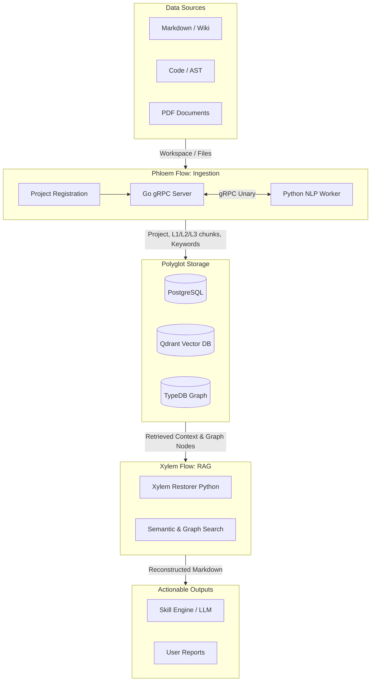

# 02. The Rhizome Pipeline: Ingestion & RAG

The Gopedia pipeline is conceptually modeled after a plant's biological transport system. It is divided into two major flows: the **Phloem Flow** (Ingestion) and the **Xylem Flow** (Retrieval/RAG). 

This document provides a high-level overview of how data travels from source to user. For detailed mechanics, refer to the specific reference documents linked below.

## High-Level Data Flow

## 1. Phloem Flow (Ingestion Pipeline)
**Phloem** is responsible for taking raw, unstructured, or semi-structured data from the Roots and converting it into a standardized L1/L2/L3 hierarchical structure. It starts by registering the entire **Project** workspace, then handles table-of-contents extraction, sentence splitting, entity recognition, vector embedding, and smart storage routing. It also manages entity identities such as Tuber keywords (`keyword_so`).

👉 **Read the detailed specifications here:** [`references/phloem-flow.md`](./references/phloem-flow.md)

## 2. Xylem Flow (RAG Retrieval Pipeline)
**Xylem** is responsible for retrieving context-aware data from the Rhizome. Instead of just returning isolated text chunks, Xylem recursively fetches the parent structural metadata (L2 sections, tables, code blocks) to reconstruct a highly accurate, human- and LLM-readable document context.

👉 **Read the detailed specifications here:** [`references/xylem-flow.md`](./references/xylem-flow.md)
