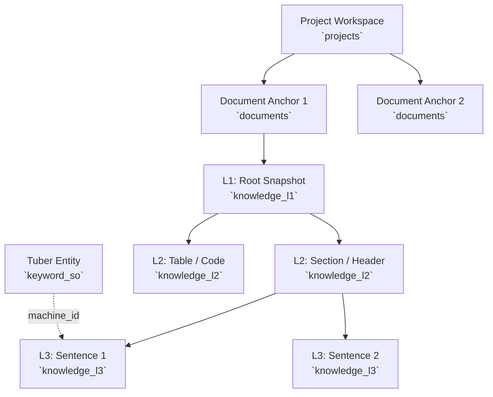

# 04. Data Hierarchy & Schema

Gopedia strictly organizes data to support high-fidelity retrieval and graph relationships. This is implemented via a tiered data model inside PostgreSQL.

## 1. Hierarchy Overview

## 2. Entity Concepts
*   **Project (`projects`)**: The root workspace container. It represents a physical directory or external source repository and possesses its own `machine_id`.
*   **Document (`documents`)**: A logical file within a Project. Contains an internal canonical `id` (UUID) and a globally stable `machine_id`.
*   **L1 (`knowledge_l1`)**: The document snapshot. Holds the table of contents and full context.
*   **L2 (`knowledge_l2`)**: The structural container (heading, table, etc.).
*   **L3 (`knowledge_l3`)**: The atomic chunk (sentence) which is vectorized.
*   **Keyword (`keyword_so`)**: A Tuber keyword entity (e.g., tags, specific terms) that maps to a `machine_id`. It shares the same deterministic integer ID generation pattern as projects and documents but exists in its own domain table.

👉 **Read the detailed database schema specifications here:** [`references/postgres-ontology.md`](./references/postgres-ontology.md)
