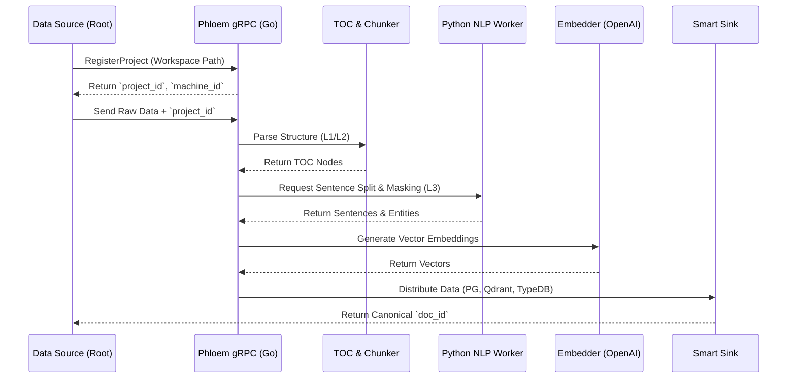

# Phloem Flow: Ingestion Pipeline Details

The Phloem Flow is a high-throughput, domain-driven ingestion pipeline. It processes incoming data, structures it hierarchically by project, and distributes it across Gopedia's polyglot storage layer (the Rhizome).

## 1. Architecture & Components

The Phloem server (`cmd/phloem/`) is written in Go and uses gRPC to communicate with external data sources and internal workers. It is designed to be highly modular, using boilerplate components to construct domain-specific pipelines.

## 2. Pipeline Stages

### 2.1. Project Registration (Roots)
Before individual files are processed, the Root entrypoint (e.g., `property/root_props/run.py`) registers the entire workspace/project.
*   **Project Anchor**: Calls `RegisterProject` via gRPC to allocate a unique `machine_id` and a `project_id` in PostgreSQL for the root directory path.
*   **Traversal**: Iterates through all files in the project directory (e.g., `*.md`), attaching the allocated `project_id` as metadata for every subsequent document ingest.

### 2.2. Domain Parsing (`internal/phloem/toc` & `chunker`)
Depending on the incoming data domain (`wiki`, `code`, or `pdf`), Phloem selects a specific pipeline:
*   **TOC Parser**: Extracts the "Skeleton" of the data (e.g., `#` headers in Markdown, or AST symbols in Code) to create **L2 Structure chunks**.
*   **Chunker**: Splits the content based on the TOC.

### 2.3. Linguistic Processing (`python/nlp_worker/`)
L3 (Atomic Content) chunks are sent via Unary gRPC to the Python NLP Worker.
*   **Masking**: Protects markdown links, URLs, and semantic versions (`v1.3`) so internal periods are not mistaken for sentence boundaries.
*   **Sentence Splitting**: Dynamically chooses the splitting engine. If the Korean ratio exceeds `GOPEDIA_NLP_LANG_HANGUL_RATIO` (default 0.12), it uses `kss`. Otherwise, it defaults to `pysbd` for English.

### 2.4. Embedding
Sentences are passed to the `Embedder` interface (currently implemented via OpenAI) to generate high-dimensional vectors for semantic search.

### 2.5. Smart Sink (`internal/phloem/sink`)
The final stage distributes the data logically to ensure data integrity and idempotency:
*   **PostgreSQL**: Stores the Workspace (`projects`), Anchor (`documents`), Revisions (`knowledge_l1`), structural metadata (`knowledge_l2`), atomic text (`knowledge_l3`), and Tuber keywords (`keyword_so`).
*   **Qdrant**: Receives the vectors and payload data, indexed strictly by `l1_id` to allow scoped filtering across the corpus.
*   **TypeDB / Redis**: Used for graph relationships and Tuber `machine_id` mappings.

## 3. Idempotency & Hashing
To prevent duplicate processing on subsequent ingests of the same document:
*   Phloem calculates `l2_child_hash` and `l3_child_hash`.
*   If the hashes match an existing `knowledge_l1` revision, vector embedding and DB writing for unchanged chunks are bypassed, saving compute resources and storage space.
