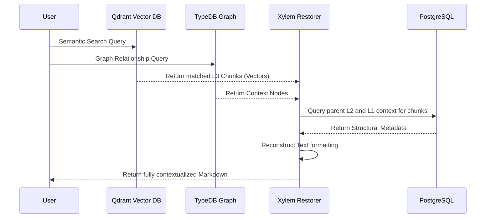

# Xylem Flow: RAG Retrieval Pipeline Details

The Xylem Flow handles the retrieval phase of the RAG (Retrieval-Augmented Generation) process. It retrieves context-aware data from the Rhizome and reconstructs the original document structure.

## 1. Architecture

## 2. Pipeline Stages

### 2.1. Vector & Graph Search
- **Qdrant**: Searches for the highest similarity L3 atomic chunks using the query vector. Filters can be applied via `l1_id`.
- **TypeDB**: Retrieves related context nodes, resolving semantic relations.

### 2.2. Context Restoration (`flows/xylem_flow/restorer.py`)
- Based on the retrieved L3 chunks, the restorer queries PostgreSQL for the surrounding hierarchy.
- It rebuilds the logical ordering (via `sort_order`).

### 2.3. Formatting
- Applies appropriate format based on L2 metadata (e.g., `block_type = table` formats data as a Markdown table, `code` wraps data in triple backticks with language tags).
