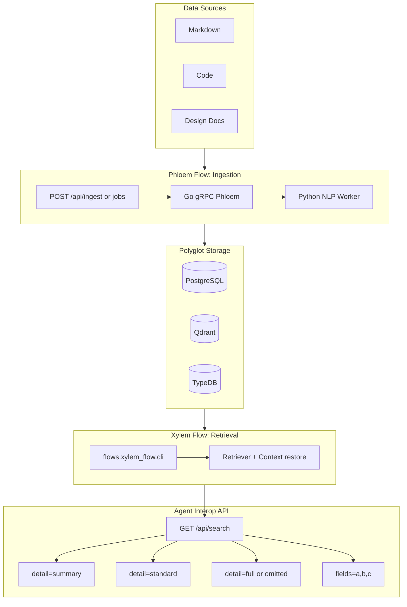

# 02. Rhizome Pipeline in Rev3: Ingestion & Agent Retrieval

Rev3 preserves the biological flow model from Rev2 and adds explicit agent-oriented response shaping at the API edge.

## High-Level Data Flow

## 1. Ingestion Path (Unchanged from Rev2)
- Source documents are parsed and normalized into hierarchical records (L1/L2/L3).
- Vectors are stored in Qdrant, structure in PostgreSQL, relations in TypeDB.
- Async ingest jobs remain the operationally recommended path for agents.

## 2. Retrieval Path (Extended in Rev3)
- Retrieval still starts from semantic vector search over L3.
- Context enrichment reconstructs hierarchy and metadata.
- Final API serialization now supports staged payload sizes for agent workflows.

👉 See detailed retrieval behavior in [`references/xylem-flow.md`](./references/xylem-flow.md).  
👉 See API parameter contract in [`references/agent-interop-api.md`](./references/agent-interop-api.md).
