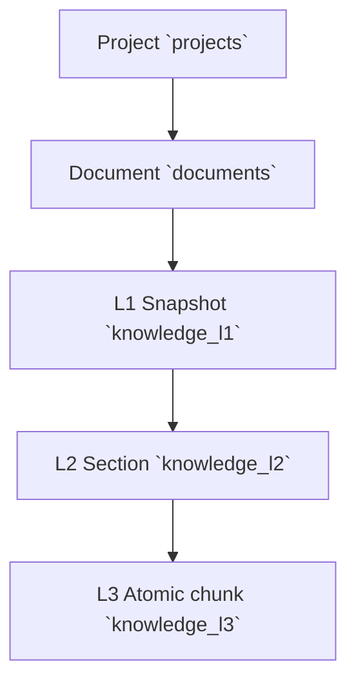

# 04. Data Hierarchy & Retrieval Contract (Rev3)

Gopedia keeps Rev2's strict hierarchy while formalizing how that hierarchy is projected to agents in JSON.

## 1. Hierarchy Overview

## 2. Logical Entity Roles
* **Project**: workspace root and ownership boundary.
* **Document**: canonical file identity in project scope.
* **L1**: document-level snapshot and high-level context.
* **L2**: structural section (heading/table/code block).
* **L3**: smallest retrievable semantic unit for vector search.

## 3. Rev3 JSON Retrieval Fieldsets

When `GET /api/search?format=json` is used:

### `summary`
- `doc_id`
- `l3_id`
- `score`
- `title`
- `snippet`
- `source_path`

### `standard`
- all `summary` fields
- `project_id`
- `l1_id`
- `l2_id`
- `section_heading`
- `breadcrumb`

### `full` (or omitted)
- all `standard` fields
- `surrounding_context` (when present)

## 4. Sparse Override
- `fields=a,b,c` returns only requested allowed keys.
- If `fields` is set, it overrides `detail`.
- Invalid `detail` or unknown `fields` key results in `HTTP 400`.

👉 For exact API examples and behavior, see [`references/agent-interop-api.md`](./references/agent-interop-api.md).
