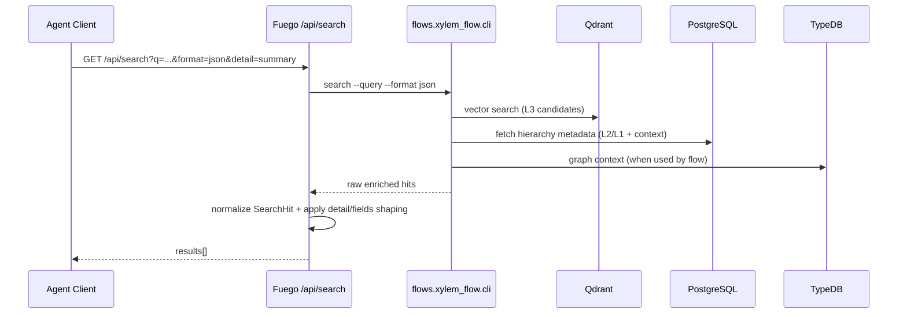

# Xylem Flow: Retrieval Pipeline (Rev3 Reference)

Rev3 keeps the core Xylem retrieval mechanics from Rev2 and adds explicit response shaping for AI agents at the API boundary.

## 1. Retrieval Architecture

## 2. Stage Semantics

### 2.1 Candidate Discovery
- Use `detail=summary` for low payload:
  - `doc_id`, `l3_id`, `score`, `title`, `snippet`, `source_path`

### 2.2 Grounding Pass
- Use `detail=standard` when location metadata is required:
  - adds `project_id`, `l1_id`, `l2_id`, `section_heading`, `breadcrumb`

### 2.3 Full Context
- Use omitted `detail` or `detail=full` for full response object.
- Includes `surrounding_context` when available.

## 3. Sparse Projection
- `fields=` can project only required keys for specialized agent loops.
- This reduces transport and prompt token usage when clients already track IDs.

## 4. Operational Notes
- Default search format remains markdown when `format` is omitted.
- JSON shaping is only applied when `format=json`.
- Full default JSON remains backward-compatible for older clients.
