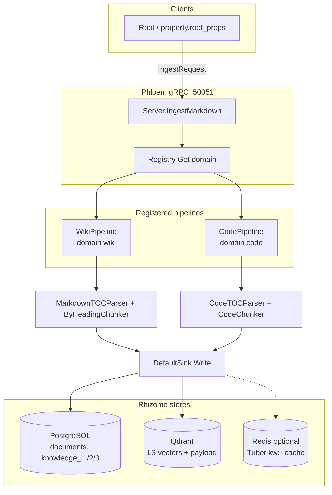

# Phloem (Ingestion) — Overview

**Phloem** is the Go gRPC ingestion service. It receives document content from clients (typically **Root**), routes by **domain**, parses and chunks, then persists to **Rhizome** (PostgreSQL, Qdrant; optional Redis for Tuber keywords). NLP sentence splitting is optional via a gRPC **NLP worker**.

- **Entry binary**: `cmd/phloem/main.go`
- **gRPC service**: `internal/phloem/server.go` — `IngestMarkdown`, `RegisterProject`, …
- **Deep dive**: [pipeline.md](./pipeline.md)
- **Design evolution (chunking, L3 policy)**: [../Rev4/](../Rev4/) (e.g. atomic L3, embedding strategy)

## Architecture (current code)

**Domain routing**: `IngestRequest.domain` or `source_metadata["domain"]`, default `"wiki"`. See `domainFromRequest` in `internal/phloem/server.go`.

**Not shown**: Optional **NLP worker** (`GOPEDIA_NLP_WORKER_GRPC_ADDR`) for L2 → L3 sentence processing inside `DefaultSink` (`internal/phloem/sink/writer.go`). **Embedding** uses `embedder.NewOpenAI()` in `cmd/phloem/main.go` (OpenAI path; Qdrant upsert skips if embedder/client nil).

## Related docs

| Doc | Role |
|-----|------|
| [pipeline.md](./pipeline.md) | Stages, modules, configuration |
| [../../phloem/README.md](../../phloem/README.md) | Package layout and extension points |
| [../Rev4/01-chunking-architecture.md](../Rev4/01-chunking-architecture.md) | Chunking design notes |

## Known gaps and improvement backlog

Items below are **inferred from the repo** (code + `doc/design/plan/TODO.md`); they are not a committed roadmap.

| Area | Status / gap | Notes |
|------|----------------|--------|
| **PDF domain** | `internal/phloem/domain/pdf.go` exists; **`cmd/phloem/main.go` does not register** `domain.PDF` | Using `domain=pdf` returns “no pipeline registered” unless another binary registers it. |
| **Embeddings in Phloem** | Single `embedder.NewOpenAI()` in main | `internal/phloem/embedder/` may support more backends; local/multilingual path often paired with Xylem via `GOPEDIA_EMBEDDING_BACKEND=local` for *query* side — **ingest and query models must stay aligned** for search quality. |
| **TypeDB** | Health check only in API; **no TypeDB write** in `DefaultSink` | Comments refer to `l1_id` as a logical “document node” for graph use; RAG path is PG + Qdrant today. |
| **Chunking / scale** | Heading + code chunkers in tree | See TODO: semantic or hybrid chunking for boundary misses at scale. |
| **Idempotency & ops** | IMP-01 / IMP-07 style logic in `writer.go` | Index reset / `DELETE /api/index` still listed as future in design TODO. |

## Planned / possible directions (not implemented)

- Register **PDF** (and any new domain) in `cmd/phloem/main.go` when product-ready.
- **Index reset API** for eval / clean re-ingest (`doc/design/plan/TODO.md`).
- Align **Rev4** atomic L3 + metadata embedding with actual `writer.go` / Qdrant payload fields (incremental).
