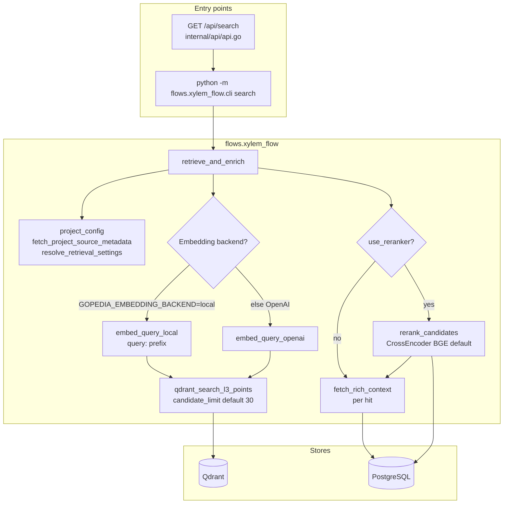

# Xylem (RAG retrieval) — Overview

**Xylem** is the Python retrieval path: **query embedding → Qdrant L3 search → optional cross-encoder rerank → PostgreSQL “rich context”** (neighbors, headings, metadata). It is invoked via **`flows.xylem_flow.cli`** and, in production API mode, from the **Fuego** HTTP server as a subprocess (same module).

- **Core API**: `flows/xylem_flow/retriever.py` — `retrieve_and_enrich()`, `fetch_rich_context()`, `rerank_candidates()`  
- **CLI**: `flows/xylem_flow/cli.py` — `search`, `restore`  
- **HTTP**: `GET /api/search` in `internal/api/api.go` → `python -m flows.xylem_flow.cli search ...`  
- **Deep dive**: [pipeline.md](./pipeline.md)

## Architecture (current code)

**Rerank order (important)**: Reranking runs on **(hit, l3_id)** pairs **after** Qdrant returns up to `candidate_limit` points and **before** trimming to `final_limit`. It uses **L3 `content` from PostgreSQL** plus the **cross-encoder** (`sentence_transformers.CrossEncoder`), not the Rev4 “metadata-weight table” in code — that document is a **design target**.

**TypeDB**: Not used in `flows/xylem_flow/`; semantic RAG is Qdrant + PG.

## API search parameters (rerank)

From `internal/api/api.go` query string:

- `reranker=true` → adds `--reranker` to CLI  
- `reranker_model=...` → `--reranker-model`  
- `project_id`, `top_k` → `--project-id`, `--limit`

## Related docs

| Doc | Role |
|-----|------|
| [pipeline.md](./pipeline.md) | Parameters, `fetch_rich_context` levels, restorer |
| [../Rev3/references/xylem-flow.md](../Rev3/references/xylem-flow.md) | Older sequence diagram (API stages) |
| [../Rev4/03-atomic-l3-metadata-strategy.md](../Rev4/03-atomic-l3-metadata-strategy.md) | Metadata-aware rerank **design** (not fully implemented in `rerank_candidates`) |

## Known gaps and improvement backlog

| Area | Status / gap | Notes |
|------|----------------|--------|
| **Metadata-aware rerank** | Rev4 describes weighted rerank by `source_path`, `section`, `fact_tags` | Current `rerank_candidates()` is **query–content cross-encoder only** (no metadata scoring in Python). |
| **Subprocess per request** | API runs **new Python process** for each search | Cross-encoder load can repeat if process is cold; see `doc/design/plan/TODO.md` — warm service or long-lived worker. |
| **candidate_limit** | Default **30** in `retrieve_and_enrich` | Not exposed on HTTP API as a first-class param (CLI supports `--limit` for final; API passes `top_k` → `--limit` only for final). |
| **Hybrid retrieval** | Vector-only | TODO mentions BM25/keyword + vector; not in `retriever.py`. |
| **Xylem ↔ ingest alignment** | Project metadata drives Qdrant host/collection/embedding | `resolve_retrieval_settings` in `project_config.py` — must match Phloem ingest for collection and embedding space. |

## Planned / possible directions (not implemented)

- **Rev4-style rerank** or a dedicated scoring layer after dense retrieval.  
- **Long-lived Xylem service** (gRPC/HTTP) to avoid subprocess + model reload.  
- **Expose `candidate_limit` / `neighbor_window` / `context_level`** on `/api/search` for tuning without code change.  
- **Adaptive rerank** (e.g. Rev3 roadmap) when hit-score spread is low.
